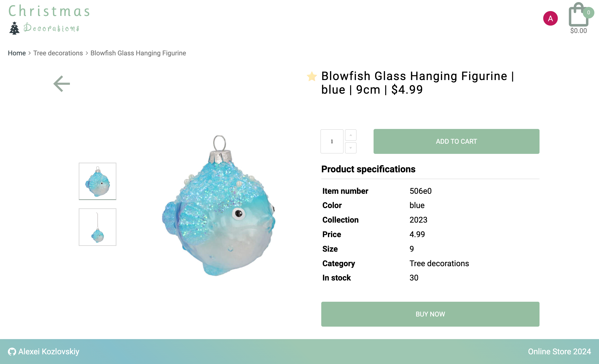
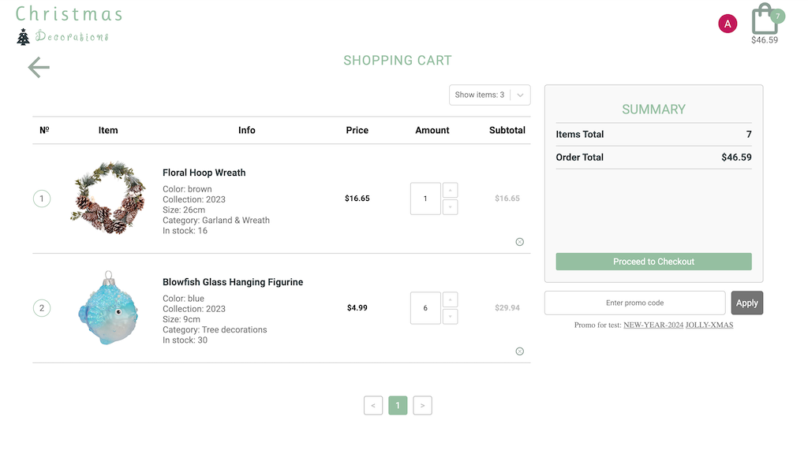
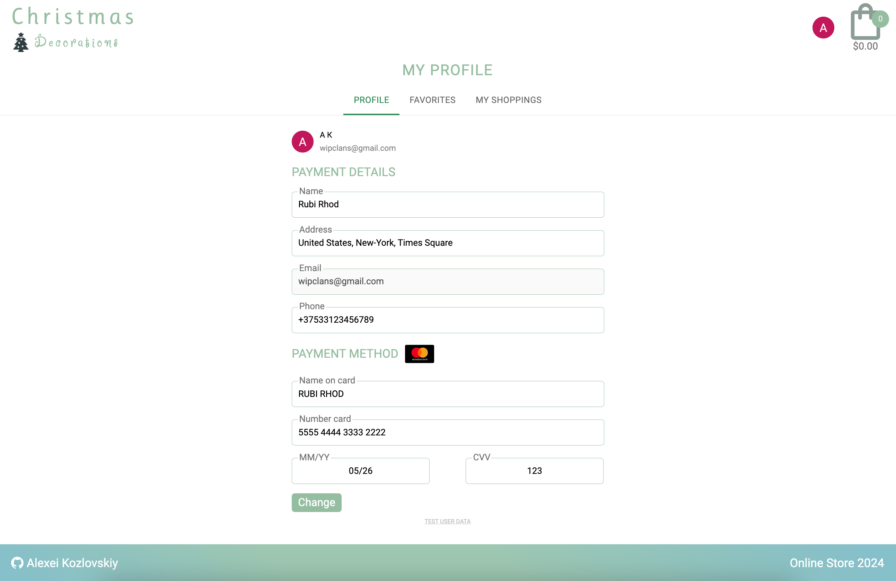

#  Online-store-react 

This project is an online store built using React and Nest, designed to provide a seamless shopping experience. With its intuitive interface and dynamic functionalities, the Online Store offers a user-friendly platform for customers.

## Deploy app in [here](https://online-store-react-94.netlify.app/).
First fetching data is can take near 1-3 minutes, further is fast.

## Backend part in [here](https://github.com/AlexeiKozlovskiy/online-store-nest).

## Features for customers
- Product Catalog: Browse through a diverse range of products neatly organized into categories.
- User Authentication: Secure sign-up and login functionalities for customers.
- Shopping Cart: Add desired items to the cart for a convenient shopping experience.
- Checkout Process: Seamless checkout with payment options for smooth transactions.

## Developer features
- Using [own backend service](https://github.com/AlexeiKozlovskiy/online-store-nest) built on Nest, with using prisma database. Servise deploed in [here](https://render.com/).
- Standard and google authentication, using bearer token, with opportunity his refreshing. 
- Forms introduced in all modal windows and profile page, made using React Hook Form, with possibility common validation all fields. 
- Cart products, and auth state build with Redux Toolkit.
- Product fetching is developed using RTK Query. Fetching profile user data using React Query + axios. Fetching all app data using axios.
- Interaction with application components, such as filters, sorting, search, pagination, viewswitcher changes and saves in URL parameters.
- Product filters have balancers. When you change one or several filters, and the search field, other filters will be changed based on the displayed products.
- SSR mode, for now work only **locally**. In Netlifae deploy available CSR mode.
- Using other small libraries, such as: paginate, select, slider, skeleton, persist.
- Maintaining a list of tasks, pull requests, commits, task board.

## Common stack
- TS
- React
- Nest
- Prisma
- Vite
- React Router
- Reduxjs Toolkit
- RTK Query
- React Query
- Axios
- React Hook Form
- React Loading Skeleton
- React Pagination
- React Select
- React Slider

## Installation
To run this project locally, follow these steps:

- Clone this repository. `https://github.com/AlexeiKozlovskiy/online-store-react.git`
- Checkout to the development branch `git checkout develop`
- Install dependencies using `npm install`.
- Rename `.env.example` to `.env`
- Run locally with SSR mode `npm run start`.

## Pages

### Main page
 

### Prouct page
 

### Cart page
You can open cart page, pressed the cart logo in header.

 

### Profile page
You can open profile page, pressed the "My profile" button in profile modal window.

 

 ### My favorites
You can open my favorites page, pressed the "My profile" button and then press My favorites btn on tabs.

 

### Profile modal
You can call the user modal window, pressed the user logo nearby the cart logo. You must be **authorization**. 
 

### Sign UP modal
 

### Sign IN modal
 

### Payment modal
You can call the Payment modal window, pressed the user Proceed to Checkout button in cart page. You must be authorization.
 

